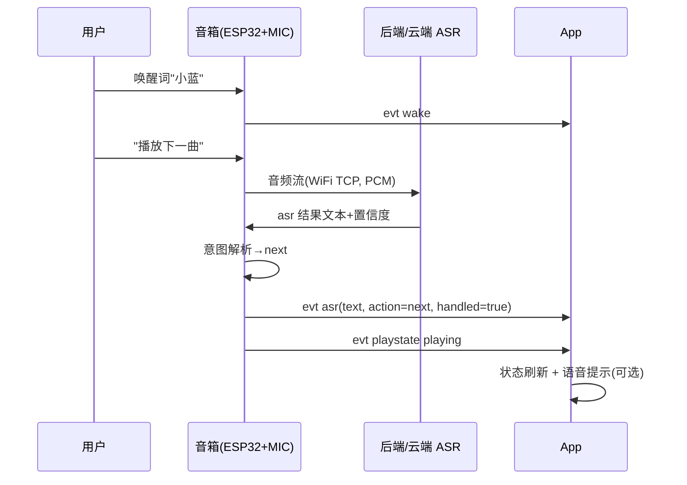

# 语音控制 — 接口升级清单与实施规划（后端交接稿）

> 版本：v0.1（草案）
> 日期：2026-08-13
> 交接对象：后端 / 固件设计工程师
> 上游依据：`sperker-APP/interface.md`、`sperker-APP/app-design.md`

## 1. 目标与范围

- **目标**：音箱支持语音控制——"唤醒词 → 说指令 → 执行动作（播放/音量/EQ/选歌/关机等）"，App 同步展示语音状态与识别结果。
- **范围**：本文只覆盖「当前接口未覆盖的部分」+ 大致实施规划；ASR 引擎、音频链路、云端服务等具体设计由后端负责。
- **关键约束（必须先看）**：
  - 串口 115200 baud 无法承载音频流（16kHz/16bit/mono ≈ 256kbps ≫ 115200）。
  - 因此：**控制命令走 JSON 协议；音频数据不走串口**——走预留的 WiFi TCP 传输（`SPEAKER_ENABLE_WIFI_TRANSPORT`），或由 App 侧麦克风采集。

## 2. 方案选型（后端二选一或组合）

| 方案 | 麦克风位置 | ASR 位置 | 优点 | 缺点 |
|---|---|---|---|---|
| A. App 侧语音 | PC/手机麦克风 | App 本地或云端 | 零硬件改动，最快落地 | 说话必须靠近电脑 |
| B. 端侧唤醒 + 云端 ASR | 音箱（新增 INMP441） | 云端 | 体验最好，唤醒词本地 | 需加麦克风 + WiFi 传输 |
| C. 端侧全本地 | 音箱 | 端侧 ESP-SR | 离线可用，无云端成本 | 无 PSRAM 内存紧张，命令词有限 |

- **推荐组合**：B 为主（产品体验）、C 兜底离线、A 作为开发期加速器。最终由后端定。

## 3. 接口升级清单（当前协议未覆盖）

> 所有新增均为向后兼容：旧固件对新命令回 `unknown_command`，App 按能力探测置灰。

### 3.1 新增命令（App/后端 → 音箱）

| 命令 | 请求示例 | 响应 | 说明 |
|---|---|---|---|
| `getMicStatus` | `{"cmd":"getMicStatus"}` | `{"ok":true,"mic":true,"gain":60,"mode":"wakeword"}` | 麦克风硬件/状态查询 |
| `setMic` | `{"cmd":"setMic","enable":true}` | `{"ok":true}` | 麦克风采集开关 |
| `setVoice` | `{"cmd":"setVoice","mode":"off"\|"wakeword"\|"always"}` | `{"ok":true}` | 语音控制总模式（关/唤醒词/随时听） |
| `setWakeWord` | `{"cmd":"setWakeWord","word":"小蓝"}` | `{"ok":true}` | 自定义唤醒词（需固件支持重训练/词库） |
| `setMicGain` | `{"cmd":"setMicGain","gain":60}` | `{"ok":true}` | 麦克风增益 0–100，适配远场 |
| `audioStream` | `{"cmd":"audioStream","start":true}` | `{"ok":true}` | **仅 WiFi TCP 通道**：PCM 音频流开关（含帧格式协商） |
| `asrText`（可选） | `{"cmd":"asrText","text":"播放下一曲"}` | `{"ok":true,"action":"next"}` | App 侧 ASR 时把文本回注设备做统一意图解析 |

### 3.2 新增事件（音箱 → App）

| 事件 | 示例 | 触发 |
|---|---|---|
| `mic` | `{"evt":"mic","on":true,"gain":60}` | 麦克风状态变化 |
| `wake` | `{"evt":"wake","word":"小蓝"}` | 唤醒词命中（App 做提示动画/呼吸灯） |
| `asr` | `{"evt":"asr","text":"播放下一曲","conf":0.93,"action":"next","handled":true}` | ASR 结果；`handled=false` 表示未识别/未执行 |
| `voice` | `{"evt":"voice","state":"idle\|listening\|processing\|speaking"}` | 语音引擎状态机变化 |
| `talking` | `{"evt":"talking","active":true}` | VAD 检测到人声（可驱动 UI/降噪） |
| `audio` | `{"evt":"audio","sec":1.2,"bytes":3840}` | 音频流元数据（仅 WiFi 通道，App 端统计） |

### 3.3 `getStatus` 新增字段

```json
"mic": true,          // 麦克风可用
"voice": "wakeword",  // off | wakeword | always
"wakeword": "小蓝"     // 当前唤醒词（未配置则省略）
```

### 3.4 新增错误码

| 错误码 | 场景 |
|---|---|
| `mic_busy` | 麦克风被占用/采样中 |
| `no_wakeword` | 未配置唤醒词却要求 wakeword 模式 |
| `asr_failed` | 云端/本地识别失败 |
| `audio_bandwidth` | 当前传输不支持音频流（如走串口） |
| `voice_busy` | 正在处理上一条语音 |

### 3.5 与既有/规划命令的关系

语音只是"入口"，动作执行仍走统一命令表：现有 `play/pause/toggle/next/prev/setVolume`，
预留 `setEq/setSource/getBattery`，以及 `app-design.md` 提案中的
`mute/btDisconnect/btReconnect/playFile/powerOff` 等。**语音解析结果一律落成上述命令**，不另起一套执行通道。

## 4. 语音意图 → 命令映射（草案，供后端细化）

| 用户指令示例 | 意图 | 落到命令 |
|---|---|---|
| 播放 / 暂停 / 继续 | 播放控制 | `play` / `pause` / `toggle` |
| 下一首 / 上一首 | 切歌 | `next` / `prev` |
| 音量调到 30 / 大一点 / 小点 / 静音 | 音量 | `setVolume` / `mute` |
| 换成摇滚 EQ / 流行 | 音效 | `setEq`（P5 后） |
| 播放 TF 卡里的《蓝莲花》 | SD 选歌 | `listTracks` → `playFile`（P6 后） |
| 电量多少 / 蓝牙还连着吗 | 状态查询 | `getBattery` / `getStatus`（App 展示） |
| 断开蓝牙 / 重新连接 | 蓝牙管理 | `btDisconnect` / `btReconnect` |
| 十分钟后关机 / 播完这首停 | 定时 | App 本地定时器 或 `setSleepTimer`（见开放问题） |
| 关机 | 电源 | `powerOff` |
| 没听清 / 未知指令 | 回退 | 不执行；`asr.handled=false`，App 提示重说 |

## 5. 交互时序（推荐方案 B）



## 6. 硬件/固件约束（给后端参考，非定稿）

- 麦克风建议 **INMP441（I²S）**，需新增 DIN 引脚；与 MAX98357A 共用 BCLK 需评估，具体由硬件设计定。
- 内存：当前无 PSRAM；**端侧只建议跑唤醒词**（ESP-SR），全量本地 ASR 谨慎评估。
- 带宽：音频流必须走 WiFi TCP；串口通道上 `audioStream` 应回 `audio_bandwidth`。
- 功耗：麦克风常开会增加功耗 → `voice` 模式与电源管理（P7）联动，空闲降采样或关麦。

## 7. 大致实施规划（里程碑）

| 阶段 | 内容 | 协议依赖 | 验证标准 |
|---|---|---|---|
| V0 | App 侧语音 MVP（PC 麦克风 → ASR → 现有命令） | 无 | 电脑前说话能遥控音箱 |
| V1 | 协议扩展落地（§3 命令/事件/字段/错误码） | 本文 §3 | 固件上报 mic/voice/wake/asr，App 实时展示 |
| V2 | 端侧唤醒 + 录音上行（INMP441 + ESP-SR + WiFi 音频流） | `audioStream` + WiFi TCP | 喊"小蓝，播放下一曲"可遥控 |
| V3 | 体验完善（自定义唤醒词、连续对话、TTS 反馈、误唤醒统计） | 可选扩展 | 全链路稳定可用 |

## 8. 交接清单（后端需要设计的内容）

1. 协议字段/枚举定稿（本稿 §3 为草案基线）。
2. 音频封包格式（帧头、采样率、位深、声道、时长，WiFi 通道）。
3. ASR 意图 Schema（`intent / slots / confidence`）。
4. 语音状态机（`idle/listening/processing/speaking` 迁移规则）。
5. 唤醒词本地训练与词库更新流程。
6. 安全与隐私（唤醒词不出设备、音频不落盘、断网降级）。

## 9. 开放问题（需后端/产品决策）

- 唤醒词本地 vs 云端（隐私 vs 灵活性）。
- ASR 语言与自定义词库（歌名"蓝莲花"类专名识别率）。
- 远场/噪声环境下的唤醒与识别阈值。
- 是否新增 `setSleepTimer` 命令，还是统一由 App 本地定时器实现。
- 语音反馈用 App 提示音还是设备 TTS（TTS 需额外硬件/固件资源）。
